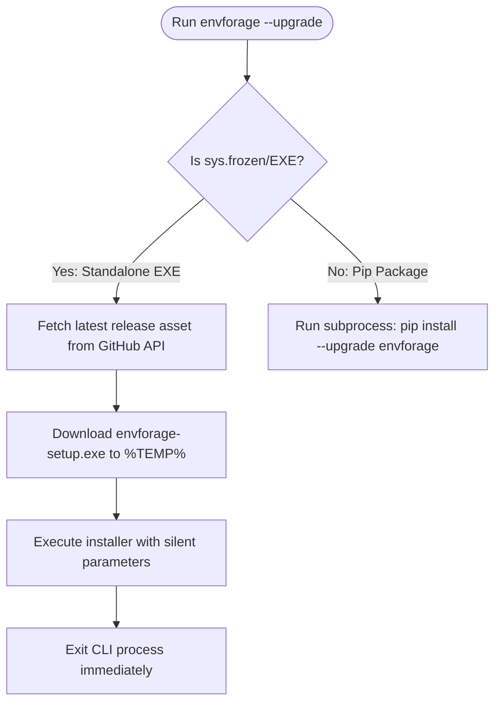

# EnvForage — Windows GUI Installer & Auto-Updater Blueprint

This document defines the complete architectural context, features, configurations, and step-by-step implementation blueprint for adding a Windows GUI Setup Installer and an automated CLI upgrading mechanism to the EnvForage project. 

This file serves as the definitive context source for any future developer or AI agent executing this implementation.

---

## 1. Architectural & Repository Context

EnvForage is an intelligent environment provisioning platform that automates ML workspace configuration across Windows, WSL, and Linux.

### Component Boundaries
*   **CLI Agent (`cli/envforage/`):** A standalone Click-based Python application that performs local hardware inspection (OS, CPU, RAM, GPU, CUDA toolkit, Python environments) and outputs structured `DiagnosticReport` JSON.
*   **FastAPI Backend (`backend/`):** The server that hosts the Compatibility Engine, ML Profiles registry, Webhooks dispatcher, and the AI troubleshooting layer (integrating with OpenRouter, OpenAI, Anthropic, or local Ollama).
*   **Next.js Frontend (`frontend/`):** The web user interface for running diagnostics, browsing ML profiles, and generating provisioning setup scripts.

### Current Version State: `v2.1.0`
The project version is unified repository-wide at `v2.1.0` (in `pyproject.toml`, `package.json`, Helm `Chart.yaml`, and documentation). 
*   **Executable Verified:** Standalone compilation of the CLI agent has been verified using PyInstaller. Running `pyinstaller --onefile --name envforage envforage/__main__.py` compiles successfully into a single `envforage.exe` that executes offline on Windows AMD64 systems with zero external Python requirements.
*   **Integrity:** All 774 backend tests and 154 CLI tests pass with 100% success rate. All core application code is clean of ruff linting violations.

---

## 2. Feature Specification: Windows GUI Installer

The GUI installer will be built using **Inno Setup (v6+)**, configured via `cli/installer/setup.iss`. It packages the compiled `envforage.exe` binary into a professional setup wizard.

### A. Hybrid Installation Scope (A-3 Selection)
The installer supports both administrative and non-administrative scopes natively using:
```ini
[Setup]
PrivilegesRequired=none
PrivilegesRequiredOverridesAllowed=dialog
```
*   **GUI Prompt:** The installer opens a standard Windows prompt asking: *"Install for me only (recommended)"* or *"Install for all users (requires administrator privileges)"*.
*   **User Install:** Defaults `{app}` to `%LOCALAPPDATA%\Programs\EnvForage`. Does not require Windows User Account Control (UAC) prompts.
*   **All Users Install:** Defaults `{app}` to `%ProgramFiles%\EnvForage` and triggers the UAC prompt to elevate privileges.

### B. Shell & System Integrations (B Tasks)
The installer presents four optional checkboxes during configuration:
1.  **Add to PATH (Task: `envpath`):** Appends `{app}` to the system `Path` variable. Uses Inno Setup's `HKA` (Hive Registry Association) root to map dynamically to current user registry (`HKCU\Environment\Path`) or machine registry (`HKLM\SYSTEM\...\Environment\Path`) based on the selected installation scope.
2.  **Folder Right-Click Context Menu (Task: `DirectoryContext`):** Registers a context menu entry for directory backgrounds:
    *   **Label:** `"Diagnose ML Environment Here"`
    *   **Execution:** Runs `{app}\envforage.exe diagnose` inside the right-clicked directory.
3.  **JSON File Right-Click Context Menu (Task: `FileContext`):** Registers an association for `.json` files:
    *   **Label:** `"Generate Repair Script with EnvForage"`
    *   **Execution:** Runs `{app}\envforage.exe fix --report "%1"`.
4.  **Custom URL Protocol Handler (Task: `ProtocolHandler`):** Registers the `envforage://` URI scheme to allow web app integration:
    *   **Protocol command:** `{app}\envforage.exe diagnose --send "%1"`.

### C. Pre-requisite Hardware Warnings (D Selection)
The setup wizard includes custom Pascal scripting to inspect hardware and display warnings in **bold red text** on the select directory page:
*   **NVIDIA GPU Detection:** Searches the Windows Display Adapters registry key:
    `SYSTEM\CurrentControlSet\Control\Class\{4d36e968-e325-11ce-bfc1-08002be10318}\000*` for description strings containing `"NVIDIA"`.
*   **Driver Check:** Verifies if `nvidia-smi.exe` is missing from system folders (`C:\Windows\System32` and `C:\Program Files\NVIDIA Corporation\NVSMI`).
*   **Action:** If a GPU is found but the driver is missing, a red label displays:
    `[WARNING] NVIDIA GPU detected, but no driver/nvidia-smi was found. Please install NVIDIA drivers to enable CUDA hardware profiling.`

### D. Smart Upgrades & Process Locking
*   **App Lock Prevention:** Set `CloseApplications=yes` to automatically detect if an active terminal is currently running `envforage.exe` and prompt the user to close it during an upgrade.
*   **Uninstall Cleanup:** Add `[UninstallDelete]` to delete `%USERPROFILE%\.envforage` (removing SQLite telemetry databases and caches) on uninstallation.
*   **AppId Mapping:** Set `AppId={{5DCE63EF-A39B-4DDF-90A0-B6D7D3193C5F}` so that reinstalling/upgrading automatically replaces the older version cleanly.

---

## 3. Feature Specification: CLI Auto-Updater

The update check system in `cli/envforage/utils.py` will be expanded to support manual and automated binary upgrades.

### A. Subcommand: `envforage --upgrade` (or `upgrade` action)
Triggering the upgrade executes distinct pipelines depending on how the package is running:



*   **GitHub Releases Hook:** Queries `GET https://api.github.com/repos/rishabh0510rishabh/EnvForage/releases/latest`, parses release assets, and fetches the `envforage-v*-setup.exe` URL.
*   **Inno Setup Silent Parameters:**
    ```powershell
    # Triggers background install, closes active apps, overrides default questions
    envforage-setup.exe /SILENT /SUPPRESSMSGBOXES /FORCECLOSEAPPLICATIONS
    ```
*   **Pip Upgrade Command:**
    ```bash
    python -m pip install --upgrade envforage
    ```

### B. Auto-Update Configuration Toggle
*   **Config key:** `auto_update: bool` inside `CliSettings` (class `CliSettings` in `cli/envforage/config.py`).
*   **Notification Mode (`auto_update: false`):** Prompts the user when a newer version is found:
    `[!] A new version is available: vX.Y.Z. Run 'envforage --upgrade' to update.`
*   **Prompt Mode (`auto_update: true`):** Prompts the user:
    `[!] A new version of EnvForage is available (vX.Y.Z). Would you like to update now? [y/N]: `
    *   Entering `y` automatically spawns the Case A/B updater in the background and terminates the CLI session.

---

## 4. Implementation Step-by-Step Process

When ready to implement, follow these steps exactly:

### Step 1: Logo & Icon Placement
1.  Verify the developer's custom logo is copied to `cli/installer/logo.ico` (multi-resolution format containing 16x16, 32x32, 48x48, 64x64, 128x128, and 256x256 resolutions).
2.  *(Note: A high-tech placeholder logo.ico is currently available at `cli/installer/logo.ico` for initial compilation).*

### Step 2: Implement the Inno Setup Script
1.  Create `cli/installer/setup.iss` containing the configuration for directories, registry hives (`HKA`), context menu tasks, protocol handlers, and the Pascal scripting section for red hardware warning notifications.

### Step 3: Implement CLI Subcommand & Configuration
1.  Update `cli/envforage/config.py` to add the `auto_update` property (boolean, default to `false`) to `CliSettings`.
2.  Update `cli/envforage/cli.py` to include the `--upgrade` option in the main Click command group.
3.  Implement the update engine in `cli/envforage/utils.py`:
    *   Add network helper using `httpx` to query the GitHub Releases API for standalone `.exe` downloads.
    *   Add subprocess executor for background silent installation execution or `pip` upgrades.

### Step 4: Configure GitHub Actions Release Pipeline
1.  Modify `.github/workflows/release.yml`.
2.  Add a `build-windows-exe` job that runs on `windows-latest` under the `jobs` section:
    ```yaml
      build-windows-exe:
        name: Build Standalone Windows Executable & GUI Installer
        runs-on: windows-latest
        needs: release
        steps:
          - name: Checkout repository
            uses: actions/checkout@v4
            with:
              persist-credentials: false

          - name: Set up Python
            uses: actions/setup-python@v5
            with:
              python-version: "3.11"

          - name: Install dependencies
            run: |
              python -m pip install --upgrade pip
              pip install pyinstaller build
              pip install -e cli/

          - name: Compile Executable
            run: |
              cd cli
              pyinstaller --onefile --name envforage envforage/__main__.py

          - name: Compile Inno Setup GUI Installer
            uses: Horimatsu/action-inno-setup@v1
            with:
              script: cli/installer/setup.iss

          - name: Upload Installer to GitHub Release
            uses: softprops/action-gh-release@v3
            with:
              files: |
                cli/dist/envforage.exe
                cli/installer/Output/envforage-v*-setup.exe
            env:
              GITHUB_TOKEN: ${{ secrets.GITHUB_TOKEN }}
    ```

### Step 5: Local & CI Validation
1.  Compile the `.exe` locally.
2.  Run the Inno Setup GUI installer compiler locally to verify no script syntax errors.
3.  Execute local CLI unit tests (`python -m pytest` inside `cli/`) to guarantee no regressions are introduced in command processing.
